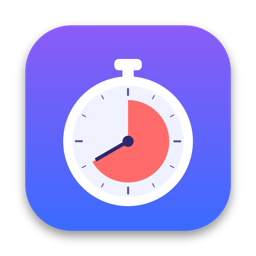
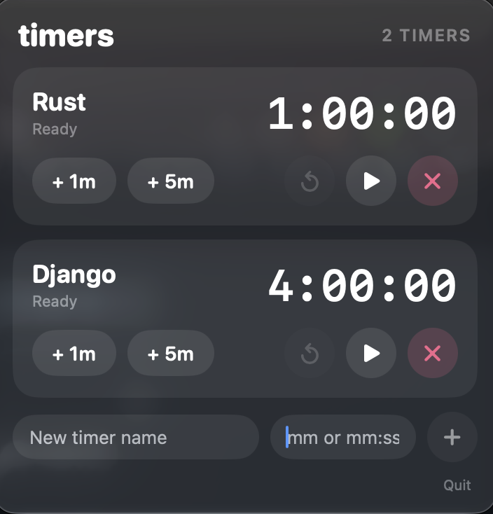

<h1 align="center">
  
  MenuTimer
</h1>

<p align="center">
  A small multi-timer that lives in your macOS menu bar.<br>
  Run several timers at once, add time on the fly, get an alarm when one ends.
</p>

<p align="center">
  <a href="https://github.com/ParsaFakhar/MenuTimer/releases/latest"></a>
  
  
</p>

<p align="center">
  
</p>

## Features

- **Multiple timers**, running side by side
- **Live countdown** in the menu bar for the timer that ends soonest
- **Quick adjust** with `+ 1m` / `+ 5m`, even while a timer is running
- **Alarm** with a bell and "Done" in the menu bar when time is up
- **Fast entry**: type `25`, `1:30` or `3:05:32` (h:mm:ss)
- **Remembers your timers** between launches
- **Native SwiftUI**: one source file, no dependencies

## Requirements

- macOS 14 (Sonoma) or later

## Installation

1. Download `MenuTimer.zip` from the [latest release](../../releases/latest).
2. Unzip it and drag **MenuTimer.app** into your `/Applications` folder.
3. Open it. macOS will block the first launch because the app is not notarized by Apple:
   - Open **System Settings → Privacy & Security**
   - Scroll to the **Security** section and click **Open Anyway** next to MenuTimer
   - Confirm with your password or Touch ID

   You only need to do this once. The button appears shortly after the blocked launch attempt.

Prefer the terminal? This does the same thing:

```bash
xattr -dr com.apple.quarantine /Applications/MenuTimer.app
```

## Usage

Click the timer icon in the menu bar to open the panel.

| Action | How |
| --- | --- |
| Start or pause a timer | Click the timer's name/time area, or the play/pause button |
| Add time | `+ 1m` / `+ 5m`. On a running or paused timer this extends the countdown. On an idle timer it makes the saved timer longer |
| Reset | The circular arrow button. Stops the timer and restores its full length |
| Stop the alarm | Click the stop button, or reset the timer |
| Snooze | Press `+ 1m` or `+ 5m` while a timer is ringing |
| Delete a timer | The pink **✕** button |
| Create a timer | Type a name and a length at the bottom, then press **Return** or the **+** button |
| Quit | **Quit** at the bottom of the panel, or `⌘Q` |

### Timer length format

| You type | Result |
| --- | --- |
| `25` | 25 minutes |
| `1:30` | 1 minute 30 seconds |
| `1:00:00` | 1 hour |

New timers start with three presets: **Focus** (25 min), **Break** (5 min) and **Tea** (3 min).

### Good to know

- The alarm repeats about every 2.5 seconds and silences itself after roughly 30 seconds.
- Timer definitions are saved, but **running timers do not survive quitting** the app.
- MenuTimer runs as a menu bar app only, so it does not appear in the Dock or the app switcher.

## Build from source

You need the Xcode Command Line Tools (no full Xcode, no project file):

```bash
xcode-select --install   # once
git clone https://github.com/YOURUSERNAME/MenuTimer.git
cd MenuTimer
./build.sh
open MenuTimer.app
```

`build.sh` compiles `MenuTimer.swift` with `swiftc`, assembles the `.app` bundle with the icons, and ad-hoc signs it.

## Customization

The settings at the top of `MenuTimer.swift` can be changed before building:

```swift
private let alarmSoundName = "Glass"   // Frog, Hero, Ping, Submarine, Funk, Sosumi, Purr
private let alarmRepeatSeconds = 2.5   // gap between alarm repeats
private let alarmMaxRepeats = 12       // alarm silences itself after ~30 s
private let panelTitle = "timers"      // header text in the dropdown
private let menuBarSymbol = "timer"    // fallback SF Symbol if MenuBarIcon.png is missing
```

## Project structure

```
MenuTimer/
├── MenuTimer.swift    # the entire app
├── build.sh           # builds and signs MenuTimer.app
├── AppIcon.icns       # app icon
└── MenuBarIcon.png    # menu bar icon (template image, tinted for light/dark mode)
```

## Uninstall

Quit the app, delete `MenuTimer.app` from `/Applications`, and optionally remove its saved timers:

```bash
defaults delete com.local.menutimer
```

## License

MIT. See [LICENSE](LICENSE).
